# Pytheas Oracle
### Autonomous Live-Web Navigator & Parimutuel Settlement Matrix on GenLayer

[](https://genlayer.com)
[](https://studio.genlayer.com)
[-10B981?style=for-the-badge)](https://explorer-studio.genlayer.com)
[](https://github.com/k-beee/pytheas-oracle/actions)
[](LICENSE)

---

## 🔗 Live Deployed Contract & Network Info

| Parameter | Value |
| :--- | :--- |
| **Network** | GenLayer StudioNet (Chain ID: `61999`) |
| **Deployed Contract Address** | [`0xdd7fc06eE80dAB8f3E50f88Eb6b3e2f51DF7d117`](https://explorer-studio.genlayer.com/address/0xdd7fc06eE80dAB8f3E50f88Eb6b3e2f51DF7d117) |
| **Intelligent Contract** | [`contracts/PytheasOracle.py`](contracts/PytheasOracle.py) |
| **Explorer** | [View on GenLayer Studio Explorer](https://explorer-studio.genlayer.com/address/0xdd7fc06eE80dAB8f3E50f88Eb6b3e2f51DF7d117) |
| **GenVM Runner** | `py-genlayer:1jb45aa8ynh2a9c9xn3b7qqh8sm5q93hwfp7jqmwsfhh8jpz09h6` |
| **Status** | Live & Verified on StudioNet |

---

## 🧭 Executive Overview

**Pytheas Oracle** is a decentralized prediction oracle and parimutuel settlement clearinghouse engineered natively for GenLayer Intelligent Contracts.

Named after Pytheas of Massalia—the ancient Greek explorer and astronomer who first ventured beyond the Pillars of Hercules to explore the northern oceans and discovered the lunar origin of ocean tides—Pytheas autonomously charts the live web to establish cryptographic certainty and objective settlement for prediction markets.

### Critical Vulnerabilities Solved:
1. **Centralized Oracle Relays:** Eliminates reliance on off-chain cron bots, signers, or multisigs; network validators directly fetch and deliberate over source HTML on-chain.
2. **Synchronous Push-Payment Gas Reverts:** Traditional EVM prediction markets loop through all stakers in a single settlement call, causing gas exhaustion. Pytheas resolves markets in $O(1)$ constant time, allowing participants to pull funds independently.
3. **Prompt Injection & Token Bloat:** In-contract regex HTML sanitization strips scripts, CSS, and DOM boilerplate before feeding evidence to the LLM prompt.
4. **Rigid Source Monocultures:** Dynamic on-chain governance allows updating and deprecating institutional source domains with anti-spoofing URL credential stripping.

---

## 🔭 The Celestial Sextant Consensus Architecture

```mermaid
graph TD
    subgraph Market Charting Phase
        A[Market Creator] -->|Define Question & Criteria| B(Pytheas Vault)
        B -->|Parse URL & Strip Credentials| C{Anti-Spoofing Gate}
        C -->|Authorized Institutional Host| D[Active Parimutuel Market]
        C -->|Host Spoofed or Disallowed| E[Transaction Revert]
    end

    subgraph The Collateral Escrow
        F[YES Stakers] -->|Deposit Native GEN| G[(YES Pool)]
        H[NO Stakers] -->|Deposit Native GEN| I[(NO Pool)]
        G --> J[(Pytheas Total Escrow)]
        I --> J
    end

    subgraph The Navigator Web Fetch
        K[Deadline Reached] --> L[resolve_market Triggered]
        L --> M[gl.nondet.web.get: Primary Source]
        L --> N[gl.nondet.web.get: Secondary Source]
        M --> O[In-Contract Regex HTML Sanitizer]
        N --> O
        O -->|Strip DOM & Styles| P[Cleaned Plain-Text Evidence]
    end

    subgraph Consensus Sextant Deliberation
        P --> Q[<<<UNTRUSTED_WEB_EVIDENCE>>> Sandbox]
        Q --> R[gl.nondet.exec_prompt]
        R --> S[Independent Validator Opinions]
        S --> T{gl.eq_principle.prompt_comparative}
        T -->|Categorical Agreement: YES/NO| U[Settlement Verdict Finalized]
        T -->|Criteria Contradictory| V[INVALID_CRITERIA: Annulled]
        T -->|Evidence Inconclusive| W[INSUFFICIENT_EVIDENCE: Safe Lock]
    end

    subgraph The Clearinghouse Clearance
        U -->|SETTLED_YES| X[O 1 Pull-Payment Claim Ledger]
        U -->|SETTLED_NO| X
        V --> Y[100% Symmetric Refund Ledger]
        
        X -->|claim_payout| Z[Winners Withdraw Pro-Rata + Remainder Dust]
        Y -->|claim_refund| AA[All Participants Withdraw 100% Capital]
    end

    style B fill:#0b1220,stroke:#06b6d4,stroke-width:2px;
    style D fill:#070b14,stroke:#06b6d4,stroke-width:2px;
    style J fill:#0b1220,stroke:#3b82f6,stroke-width:2px;
    style P fill:#070b14,stroke:#3b82f6,stroke-width:2px;
    style T fill:#0b1220,stroke:#10b981,stroke-width:2px;
    style U fill:#064e3b,stroke:#10b981,stroke-width:2px;
    style X fill:#0b1220,stroke:#06b6d4,stroke-width:2px;
```



---

## 📜 Intelligent Contract Methods

The Pytheas Oracle Intelligent Contract (`contracts/PytheasOracle.py`) exposes 18 verified public entrypoints:

### Public Writes
| Method | Type | Parameters | Description |
| :--- | :--- | :--- | :--- |
| `create_market` | Write | `title: str, criteria: str, primary_url: str, secondary_url: str, deadline: str` | Initializes a new prediction market grounded in institutional sources |
| `stake_yes` | Payable | `market_id: u32` | Deposits native GEN collateral into the YES pool |
| `stake_no` | Payable | `market_id: u32` | Deposits native GEN collateral into the NO pool |
| `resolve_market` | Write | `market_id: u32` | Autonomous multi-validator web fetch and equivalence consensus |
| `claim_payout` | Write | `market_id: u32` | $O(1)$ pull claim for winning stakers with dynamic remainder dust sweeping |
| `claim_refund` | Write | `market_id: u32` | $O(1)$ 100% symmetric refund for annulled or voided markets |
| `claim_stale_market_refund` | Write | `market_id: u32` | Dual-gated emergency escape hatch ($\ge 2$ failed attempts and $\ge 72\text{h}$) |
| `register_trusted_domain` | Write | `domain: str` | Governor adds a new institutional source to the whitelist |
| `deprecate_trusted_domain` | Write | `domain: str` | Governor removes an institutional source from the whitelist |

### Public Views
| Method | Type | Parameters | Returns | Description |
| :--- | :--- | :--- | :--- | :--- |
| `get_market` | View | `market_id: u32` | `dict` | Complete structured market state, pool volumes, and consensus proof |
| `get_market_count` | View | None | `u32` | Total count of prediction markets initialized on-chain |
| `list_market_ids` | View | None | `list` | List of all market IDs |
| `get_stake` | View | `market_id: u32, side: str, staker: str` | `u256` | Current staked collateral for a specific address and side |
| `get_claimable_amount` | View | `market_id: u32, staker: str` | `u256` | Real-time calculation of payout or refund entitlement in wei |
| `get_user_stake` | View | `market_id: u32, user_address: str` | `dict` | Consolidated user stake breakdown, claim status, and entitlements |
| `get_protocol_summary` | View | None | `dict` | Protocol version, governor address, and total market count |
| `get_authorized_domains` | View | None | `list` | Base list of curated institutional domains |
| `is_trusted_domain` | View | `domain: str` | `bool` | Verifies whether a domain or its parent host is currently approved |

---

## 🚀 Deployment to GenLayer Studio

1. Open [GenLayer Studio](https://studio.genlayer.com).
2. Connect to **StudioNet** (Chain ID: `61999`).
3. Create a new contract file and paste [`contracts/PytheasOracle.py`](contracts/PytheasOracle.py).
4. The schema generator will immediately parse all 18 methods.
5. Click **Deploy** and configure the address in `.env.local`:
   ```bash
   NEXT_PUBLIC_GENLAYER_CONTRACT_ADDRESS=0xYourDeployedAddressHere
   ```
